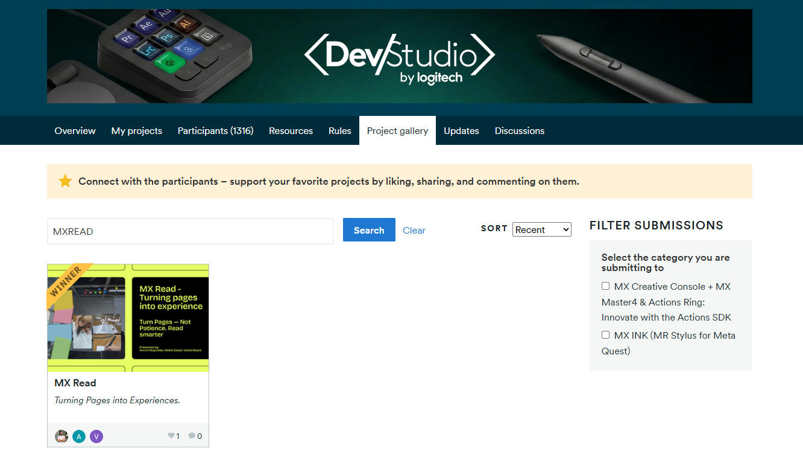
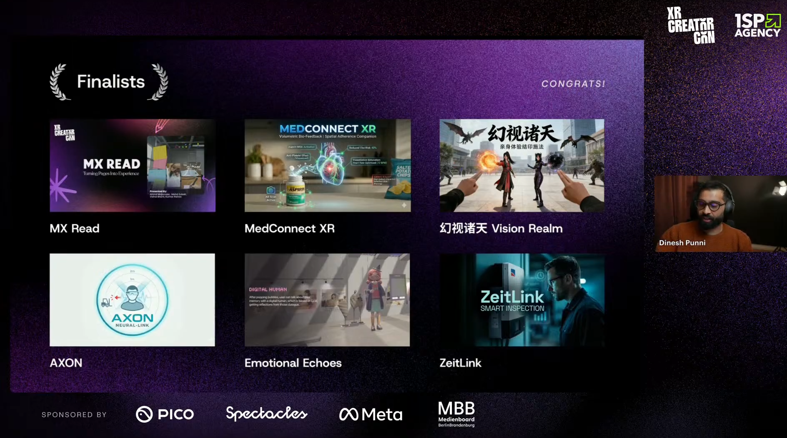

# MX Read | Turn Pages - Not Patience

   

## Overview

MX Read transforms reading into an interactive mixed reality experience. Using Meta Quest 3 and a Logitech MX Ink, users can highlight, write, and record voice notes directly onto physical books in 3D space, enabling faster and clearer understanding of complex content.

Built for DevStudio 2026 by Logitech, MX Read introduces spatial, multimodal note-taking with seamless page-linked annotations and natural pen-based interaction. The interaction is optimized for the Logitech MX Pen (MX Ink) hardware.

## Demo Video

  

## Features

- Writing and drawing in 3D space
- Text highlighting with multiple color options
- Virtual sticky notes in mixed reality
- Voice note recording and playback
- Page-linked annotations using QR-based tracking

## Installation and Setup

### 1. Install the Application

- Download the `MXRead.apk` file from the latest build.
- Install it on Meta Quest 2 or Meta Quest 3 using SideQuest or ADB.

### 2. Prepare the Book

- Open the provided `QRCode.pdf` file.
- Print the page containing all 16 QR markers.
- Paste one QR marker per page on the top-right corner of each page.
- Ensure the markers are clearly visible and not obstructed.

Refer to the example image for correct placement.

### 3. Run the Application

- Launch MX Read on the headset.
- Enter mixed reality mode.
- Use the Logitech MX Ink to interact with the book.

### Usage

- Turn pages normally; annotations update automatically per page.
- Use the pen to highlight, write, draw, and place notes.
- Record and replay voice annotations linked to specific pages.

## Project Details

 **Logitech DevStudio 2026**

**Selected in the top 50** out of 250+ teams and **ranked inside the top 25 in the Hardware category** for (*MX INK (MR Stylus for Meta Quest)*). See the DevStudio project gallery: https://devstudiologitech2026.devpost.com/project-gallery

  

**XR Creator Con (XRCC) 2026**

Around **190 projects** were submitted for the [XR Creator Con 2026 (XRCC)](https://www.xrcc.events/); of those submissions, **75 teams** were selected as finalists and MX Read was among them.

  

**Category:** Novel Interaction Modalities for Gaming and Fitness

## Team

- [Amrut Mujumdar](https://github.com/amrutmuj)
- Mohd Zubair
- [Vishal Bharti](https://github.com/vishal-20264)
- Kumar Rishav

